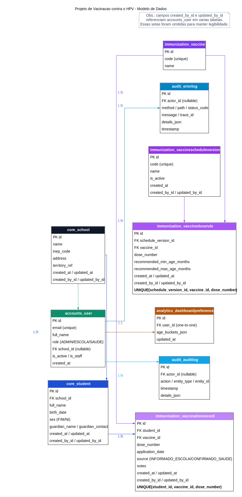

# Projeto de Vacinação Contra o HPV

## Resumo Executivo
Este repositório apresenta um protótipo funcional de nível 3 de maturidade digital para gestão da vacinação contra o HPV em estudantes, com operação integrada entre escola, saúde e administração pública.

## Objetivo
- Registrar estudantes e carteira vacinal no próprio sistema.
- Calcular automaticamente pendências e atrasos por idade e calendário versionado.
- Apoiar busca ativa nominal, dashboards e exportações operacionais.
- Garantir governança mínima com autenticação, perfis, segregação e auditoria.

## Diagrama do Modelo de Dados

## Perfis e Escopo
- `ADMIN`: visão global, estudantes, dashboards, auditoria, logs de erro, escolas, usuários e calendário.
- `ESCOLA`: gestão de estudantes e registros vacinais da própria escola, pendências da unidade.
- `SAUDE`: busca ativa consolidada, dashboards e exportações.

## Funcionalidades Principais
- Cadastro e edição de estudantes com sexo (`F`/`M`) e dados de responsável.
- Cálculo de situação vacinal (`EM_DIA`, `ATRASADO`, `INCOMPLETO`, `SEM_DADOS`).
- Calendário vacinal versionado com regra de uma versão ativa.
- Regras por dose com idade mínima/máxima (backend em meses; frontend em anos + meses).
- Busca ativa com filtros por nome, escola, status, sexo e faixa etária.
- Dashboards com filtros avançados e faixas etárias editáveis por usuário.
- Exportação CSV com delimitador `;` e opção anonimizada por iniciais.
- Auditoria (`AuditLog`) e monitoramento de falhas (`ErrorLog`) com `trace_id`.

## Enquadramento em Maturidade Digital Nível 3
A solução atende aos critérios típicos de nível 3:
- Processos críticos digitalizados e padronizados.
- Regras de negócio formalizadas e executadas de forma consistente.
- Uso operacional de dados nominais para decisão e priorização.
- Governança básica de acesso, segregação e rastreabilidade.
- Capacidade de monitoramento por indicadores e evidências.

## Segurança e Governança
- Autenticação JWT e controle de acesso por perfil (RBAC).
- Segregação por escola para perfil `ESCOLA`.
- Campos de autoria (`created_by`, `updated_by`) e trilha de auditoria.
- Captura de erros operacionais com correlação por `trace_id`.
- Documentação OpenAPI/Swagger para transparência técnica.

## Credenciais de Demonstração
- `admin@vacina.local / Admin@123`
- `operador.escola@vacina.local / Escola@123`
- `gestor.escola@vacina.local / Escola@123`
- `saude@vacina.local / Saude@123`
- `gestor.saude@vacina.local / Saude@123`

## Documentação Técnica
- `docs/arquitetura.md`
- `docs/api.md`
- `docs/lgpd.md`
- `docs/testing.md`
- `docs/estrutura.md`

## Organização de Pastas
- Frontend final em uso: `frontend/` (React + Vite em `frontend/src-react/`).
- Backend final em uso: `backend/`.
- Conteúdo legado: `legacy/frontend-angular/` e `legacy/rework-visual-reference/`.
- Logs de execução de testes: `test-result/`.

## Backlog Estratégico (fora do escopo atual)
- Integrações externas (e-SUS e afins).
- Notificações avançadas (SMS/WhatsApp).
- Observabilidade avançada (tracing, métricas e alertas).
- Importação de planilhas/CSV.
