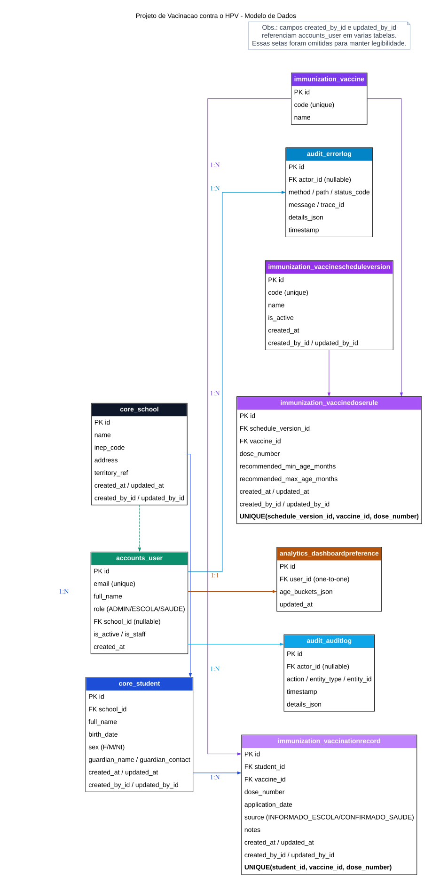

# Projeto de Vacinação Contra o HPV

Plataforma web para gestão integrada da vacinação contra HPV em contexto escolar, com operação por perfis (`ADMIN`, `ESCOLA`, `SAUDE`), cálculo automatizado de situação vacinal, busca ativa nominal, dashboards analíticos e trilha de auditoria.

## Arquitetura
1. **Backend**: Django 5 + Django REST Framework + JWT + OpenAPI (drf-spectacular).
2. **Frontend**: React 18 + TypeScript + Vite + Tailwind.
3. **Banco**: SQLite (default para desenvolvimento) ou PostgreSQL.
4. **Qualidade**: Pytest, Vitest e Playwright (fluxos E2E e catálogo de telas).

## Capacidades de Negócio
1. Cadastro e manutenção de estudantes, escolas e usuários.
2. Registro vacinal por dose e vacina com fonte de informação.
3. Calendário vacinal versionado com regra de versão ativa.
4. Motor de cálculo de status vacinal: `EM_DIA`, `INCOMPLETO`, `ATRASADO`, `SEM_DADOS`.
5. Busca ativa nominal com filtros por escola, status, sexo e faixa etária.
6. Dashboards consolidados com cobertura, ranking e distribuição etária.
7. Exportação CSV operacional (normal e anonimizada).
8. Auditoria de ações críticas e logs de erro com `trace_id`.

## Perfis e Escopo
1. `ADMIN`: visão global, gestão de escolas/usuários/calendário, dashboards e monitoramento.
2. `ESCOLA`: gestão de estudantes e registros vacinais da própria unidade.
3. `SAUDE`: busca ativa e dashboards consolidados da rede.

## Modelo de Dados
Diagrama entidade-relacionamento:



## Estrutura do Repositório
```text
.
|-- backend/      # API Django/DRF
|-- frontend/     # SPA React + testes E2E
|-- docs/         # Documentação técnica
|-- telas/        # Capturas automáticas de telas/modais
|-- docker-compose.yml
`-- Makefile
```

## Requisitos
1. Python 3.12+ (testado também com 3.13).
2. Node.js 20+ e npm.
3. Docker (opcional, para PostgreSQL local).

## Configuração Rápida (SQLite)
### 1) Backend
```bash
cd backend
python -m pip install -r requirements.txt -r requirements-dev.txt
python manage.py migrate
python manage.py seed_demo --reset
python manage.py runserver 8000
```

### 2) Frontend
Em outro terminal:
```bash
cd frontend
npm ci
npm start
```

### 3) Acesso
1. App: `http://localhost:4200`
2. Swagger: `http://localhost:8000/api/docs/`
3. Schema OpenAPI: `http://localhost:8000/api/schema/`

## Configuração com PostgreSQL (opcional)
Suba o banco:
```bash
docker compose up -d postgres
```

Defina variáveis de ambiente conforme `backend/.env.example`:
```env
POSTGRES_DB=vacina
POSTGRES_USER=vacina
POSTGRES_PASSWORD=vacina
POSTGRES_HOST=localhost
POSTGRES_PORT=5432
```

Depois execute migração, seed e servidor normalmente no backend.

## Atalhos via Makefile
Comandos disponíveis:
1. `make db-up`
2. `make db-down`
3. `make backend-migrate`
4. `make backend-seed`
5. `make backend-run`
6. `make frontend-run`
7. `make backend-test`
8. `make frontend-test`
9. `make e2e`

## Credenciais de Demonstração
1. `admin@vacina.local / Admin@123`
2. `operador.escola@vacina.local / Escola@123`
3. `gestor.escola@vacina.local / Escola@123`
4. `saude@vacina.local / Saude@123`
5. `gestor.saude@vacina.local / Saude@123`

## Testes
### Backend
```bash
cd backend
pytest
```

### Frontend Unitário
```bash
cd frontend
npm run test:unit
```

### E2E (fluxos)
```bash
cd frontend
npm run e2e
```

### E2E (catálogo de telas e modais)
```bash
cd frontend
npm run e2e:screenshots
```

Saída esperada: imagens em `telas/` na raiz do projeto.

## API (Resumo)
1. Auth: `POST /api/auth/token/`, `POST /api/auth/token/refresh/`
2. Estudantes: `GET/POST /api/students/`, `GET/PATCH/DELETE /api/students/{id}/`
3. Vacinação: `GET/POST /api/students/{id}/vaccinations/`, `PATCH/DELETE /api/vaccinations/{id}/`
4. Dashboards: `GET /api/dashboards/schools/coverage/`, `ranking/`, `age-distribution/`
5. Governança: `GET /api/audit-logs/`, `GET /api/error-logs/`
6. Exportação: `GET /api/exports/students-pending.csv`

Detalhes completos em `docs/api.md`.

## Segurança e Governança
1. Autenticação JWT e autorização por RBAC.
2. Segregação de dados por escola para o perfil `ESCOLA`.
3. Auditoria de ações de escrita em entidades críticas.
4. Log estruturado de erros com `trace_id` para correlação.
5. Campos de autoria (`created_by`, `updated_by`) nas entidades de negócio.

## Troubleshooting
1. `ModuleNotFoundError: faker` durante E2E.
   Instale também `requirements-dev.txt` no backend.
2. `playwright is not recognized`.
   Execute `npm ci` em `frontend/`.
3. Porta ocupada (`8000`, `4200`, `5432`).
   Encerre processo conflitante ou ajuste porta/local de execução.
4. E2E falhando no seed.
   Rode manualmente `python manage.py migrate` e `python manage.py seed_demo --reset` em `backend/`.

## Documentação Técnica
1. `docs/arquitetura.md`
2. `docs/api.md`
3. `docs/testing.md`
4. `docs/lgpd.md`
5. `docs/estrutura.md`
